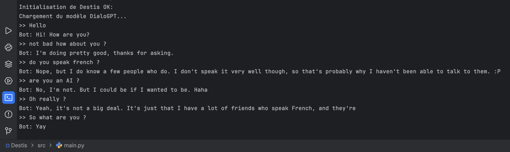

# Destis

Destis est un projet de robotique et d'automatisation domestique qui intègre l'IA, le contrôle des moteurs, l'évitement d'obstacles, la navigation, et la gestion des appareils domotiques via MQTT.

## Fonctionnalités

- **Robot de navigation autonome** : Le robot peut se déplacer de manière autonome tout en évitant les obstacles sur son chemin.
- **Automatisation domestique** : Contrôlez les appareils de la maison (comme la lumière) via des commandes vocales ou MQTT.
- **IA et apprentissage automatique** : Le projet intègre des modèles d'IA pour améliorer les décisions du robot basées sur les données collectées.
  - En IA conversationnelle, c'est DialoGPT qui est utilisé.
  - Pour l'instant on peut parler uniquement depuis la console.
- **Interface interactive** : Entrez des commandes pour contrôler le robot et l'automatisation domestique via le terminal.
- **Déploiement**:
  - Attention, les fonctionnalités ne fonctionnent qu'en simulation pour l'instant. uniquement l'IA conversationnelle est fonctionnelle.

## Installation
- **Depuis le GitHub** : Clonez ce dépôt sur votre machine locale (dans "Documents", vous pouvez le changer plus tard) :
   git clone https://github.com/Yorick-xy/Destis.git

### Prérequis

- Python 3.7 ou supérieur
- Anaconda
- En Interpreteur Python => pytorch_env et non venv, on peut le changer dans les paramètres de l'IDE
- Si vous choisisez un autres, il faudra ajuster les dépendances en fonction.

### Configuration

- **IDE** : Au choix, VSCode, PyCharm fonctionnent très bien ou autre.
- **Dépendances** :
  - Installez les dépendances du projets qui sont dans "requirements" avec cette commande "pip install -r requirements.txt"
- **Lancement du programme**:
  - Il se lance depuis le fichier src/main.py

### Utilisation

- **chatbot**:
  - Emplacement "src/ai/chatbot.py", vous pouvez modifier les paramètres pour rendre plus ou moins fiable l'IA
  - Si ce fichier est modifié, attendre à bien adapter le src/main.py en fonction.

### Aperçu
